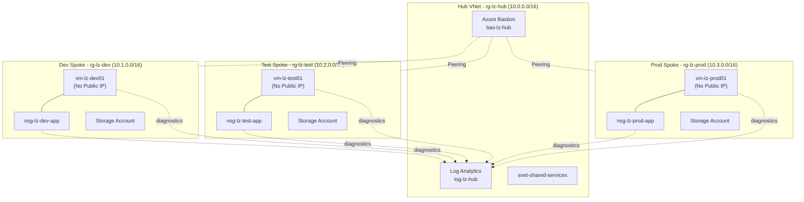

# Azure Landing Zone — Hub & Spoke Architecture with Terraform

[](https://www.terraform.io/)
[](https://azure.microsoft.com/)
[](https://github.com/features/actions)
[](LICENSE)

A production-style **Azure Landing Zone** built with modular Terraform, implementing enterprise Hub & Spoke network architecture with centralized monitoring, private compute, and secure network segmentation.

Designed so you can clone it, fill in **exactly 3 values**, and run — no code edits required.

---

## 📌 Project Objectives

- Demonstrate a real-world **enterprise landing zone pattern** used by cloud teams to onboard workloads securely.
- Show practical command of **Terraform module design**, not just single-file scripts.
- Apply **Zero Trust network principles**: no public IPs on workload VMs, NSG-restricted subnets, centralized Bastion access.
- Implement **actual centralized monitoring** — NSG and VM telemetry flow into one Log Analytics Workspace, not just an unused workspace sitting in the hub.
- Practice **environment segregation** (dev/test/prod) with isolated state and blast radius.
- Build muscle memory for patterns tested in **Azure Administrator, Azure DevOps Engineer, and Terraform Associate** certifications.

---

## 🏗️ Architecture Overview

- **1 Hub VNet** — shared services: Azure Bastion (secure jump-box access) + Log Analytics Workspace
- **3 Spoke VNets** — Dev, Test, Prod — each with an isolated app subnet, NSG, private Linux VM, and Storage Account
- **VNet Peering** connects each spoke back to the hub (bidirectional)
- **No public IP addresses** on workload VMs — all access via Azure Bastion over the peered network
- **NSGs** allow SSH only from the hub CIDR range; everything else from the internet is explicitly denied
- **Diagnostic settings** stream NSG events and VM metrics into the hub's Log Analytics Workspace
- **Cloud-init on first boot** — each VM auto-installs Nginx and serves a page identifying its environment, so there's a real running service to open/screenshot, not an empty VM

### Mermaid Diagram



### Draw.io Diagram Description

1. Central **Hub** box: Bastion icon, Log Analytics icon, "Shared Services Subnet" rectangle.
2. Three **Spoke** boxes (Dev/Test/Prod) around the hub: VNet boundary, App Subnet, NSG shield icon, Linux VM icon (no-public-IP badge), Storage Account icon.
3. Dashed bidirectional lines labeled "VNet Peering" between Hub ↔ each Spoke.
4. Dotted arrows from each spoke's NSG/VM into the Hub's Log Analytics Workspace, labeled "Diagnostic Settings".
5. Color code: Hub = blue, Dev = green, Test = yellow, Prod = red.

*(Export as `diagrams/architecture.drawio.png` — folder already exists in this repo.)*

---

## 📂 Folder Structure

```
azure-landing-zone/
├── modules/                     # Reusable Terraform modules (zero hardcoded values)
│   ├── resource-group/
│   ├── vnet/
│   ├── subnet/
│   ├── nsg/
│   ├── nic/
│   ├── linux-vm/
│   ├── storage-account/
│   ├── log-analytics/
│   ├── bastion/
│   ├── vnet-peering/
│   └── diagnostic-setting/      # Wires resources to Log Analytics
│
├── environments/
│   ├── hub/                     # Bastion + Log Analytics + Hub VNet
│   ├── dev/  test/  prod/       # Each: spoke VNet, NSG, VM, storage, peering
│       ├── main.tf  variables.tf  outputs.tf  providers.tf  versions.tf  locals.tf
│       ├── backend.tf               # Partial backend block - never edited
│       ├── backend.hcl.example       # Copy → backend.hcl, fill 1 value
│       └── terraform.tfvars.example  # Copy → terraform.tfvars, fill your values
│
├── scripts/
│   ├── bootstrap-backend.sh     # Run once: creates the remote state storage account
│   └── deploy-all.sh            # Deploys hub then all 3 spokes automatically
│
├── cloud-init/
│   └── webserver.sh.tpl         # Installs Nginx on VM first boot (per-environment page)
├── diagrams/                    # Architecture diagram exports
├── docs/screenshots/            # Portal screenshots go here
├── .github/workflows/terraform-cicd.yml
├── .gitignore
└── README.md
```

---

## 🏷️ Naming Convention (Azure CAF style)

Pattern: `<resource-type-prefix>-lz-<environment>`

| Resource | Example (dev) | Example (hub) |
|---|---|---|
| Resource Group | `rg-lz-dev` | `rg-lz-hub` |
| Virtual Network | `vnet-lz-dev` | `vnet-lz-hub` |
| Subnet (app) | `snet-dev-app` | `snet-shared-services` |
| NSG | `nsg-lz-dev-app` | — |
| NIC | `nic-lz-dev-vm01` | — |
| Linux VM | `vm-lz-dev01` | — |
| Storage Account | `stdevlz<random5>` | — |
| Bastion | — | `bas-lz-hub` |
| Log Analytics | — | `log-lz-hub` |

Storage account names get a **random 5-character numeric suffix** (via the `random_string` resource) so you never hit "name already taken" — no manual editing needed.

**Tags applied everywhere**: `Project`, `Environment`, `Owner`, `CostCenter`, `ManagedBy=Terraform`.

---

## 🚀 Deployment — Step by Step

### Prerequisites
```bash
az login
ssh-keygen -t rsa -b 4096 -f ~/.ssh/azure_lz_key   # if you don't already have a key pair
```

### Step 1 — Bootstrap the remote state backend (run once)
```bash
chmod +x scripts/bootstrap-backend.sh
./scripts/bootstrap-backend.sh
```
This prints a storage account name like `tfstatelz48213`. **Copy it.**

### Step 2 — Fill in config for each environment
For **hub** and each spoke (`dev`, `test`, `prod`):
```bash
cd environments/hub
cp backend.hcl.example backend.hcl
cp terraform.tfvars.example terraform.tfvars
```
Edit `backend.hcl` → paste the storage account name from Step 1.
Edit `terraform.tfvars` → set your `location`, `tags`, etc.

For each spoke, also edit `terraform.tfvars` and paste in:
- `ssh_public_key` → contents of `~/.ssh/azure_lz_key.pub`
- `hub_vnet_id`, `hub_vnet_name`, `hub_resource_group_name`, `log_analytics_workspace_id` → these come from the hub's outputs (Step 3 gets them for you automatically if you use `deploy-all.sh`; otherwise run `terraform output` in `environments/hub` after applying it).

### Step 3 — Deploy everything in the right order
```bash
cd ../..   # back to repo root
chmod +x scripts/deploy-all.sh
./scripts/deploy-all.sh plan     # review first
./scripts/deploy-all.sh apply    # deploys hub, then dev, test, prod automatically
```
This script applies the hub, reads its outputs, and passes them straight into each spoke — you never copy-paste values by hand.

### Step 4 — Connect to a VM via Bastion (no public IP needed)
```bash
az network bastion ssh \
  --name bas-lz-hub \
  --resource-group rg-lz-hub \
  --target-resource-id <vm-resource-id-from-terraform-output> \
  --auth-type ssh-key \
  --username azureadmin \
  --ssh-key ~/.ssh/azure_lz_key
```

### Step 4b — Open the running webpage on the VM (optional, nice for screenshots)
The VM auto-installs Nginx via cloud-init on first boot. Tunnel through Bastion to view it:
```bash
az network bastion tunnel \
  --name bas-lz-hub \
  --resource-group rg-lz-hub \
  --target-resource-id <vm-resource-id> \
  --resource-port 80 \
  --port 8080
```
Then open `http://localhost:8080` in your browser — you'll see a page confirming which environment (dev/test/prod) that VM belongs to. Great for a portfolio screenshot.

### Step 5 — Destroy (reverse order: prod → test → dev → hub)
```bash
cd environments/prod && terraform destroy -var-file=terraform.tfvars
cd ../test && terraform destroy -var-file=terraform.tfvars
cd ../dev && terraform destroy -var-file=terraform.tfvars
cd ../hub && terraform destroy -var-file=terraform.tfvars
```

---

## 📤 Pushing This Project to GitHub (Step by Step)

```bash
# 1. Go into the project folder
cd azure-landing-zone

# 2. Initialize git (skip if already a repo)
git init

# 3. IMPORTANT: verify secrets won't be committed
git status
cat .gitignore     # confirm *.tfvars and backend.hcl (without .example) are excluded

# 4. Stage and commit
git add .
git commit -m "Initial commit: Azure Landing Zone with Terraform (Hub-Spoke architecture)"

# 5. Create a new repo on GitHub (via github.com UI or GitHub CLI)
gh repo create azure-landing-zone --public --source=. --remote=origin
# OR manually: create an empty repo on github.com, then:
git remote add origin https://github.com/<your-username>/azure-landing-zone.git

# 6. Push
git branch -M main
git push -u origin main
```

**Before you push, double-check these are NOT in your commit:**
```bash
git ls-files | grep -E "\.tfvars$|backend\.hcl$"
```
This should return **nothing**. If it returns a file, remove it from git tracking:
```bash
git rm --cached environments/dev/terraform.tfvars
```

### Setting up CI/CD secrets on GitHub
Go to **Repo → Settings → Secrets and variables → Actions** and add:

| Secret | Value |
|---|---|
| `AZURE_CREDENTIALS` | Output of `az ad sp create-for-rbac --name "github-actions-lz" --role="Contributor" --scopes="/subscriptions/<sub-id>" --sdk-auth` |
| `TF_STATE_STORAGE_ACCOUNT` | The name printed by `bootstrap-backend.sh` |
| `VM_SSH_PUBLIC_KEY` | Contents of `~/.ssh/azure_lz_key.pub` |

### Making the repo look professional
- Add repo **Topics**: `terraform`, `azure`, `iac`, `devops`, `hub-spoke`, `landing-zone`
- Pin this repo on your GitHub profile
- Fill the **About** section with a one-line summary + link to this README
- Add the diagram image once exported (`diagrams/architecture.drawio.png`) so it renders on the repo's main page

---

## 🔧 Modules Explained

| Module | Purpose |
|---|---|
| `resource-group` | Creates a Resource Group with consistent tagging |
| `vnet` | Creates a Virtual Network with configurable address space |
| `subnet` | Creates a Subnet, optionally associates an NSG |
| `nsg` | Creates an NSG with a dynamic list of security rules |
| `nic` | Creates a Network Interface with **private IP only** |
| `linux-vm` | Ubuntu 22.04 LTS VM using **SSH key auth only** |
| `storage-account` | `public_network_access_enabled = false`, TLS 1.2 minimum |
| `log-analytics` | Centralized Log Analytics Workspace |
| `bastion` | Azure Bastion + its required Public IP (the *only* public IP in the whole architecture) |
| `vnet-peering` | Bidirectional peering between hub and a spoke |
| `diagnostic-setting` | Generic module — sends any resource's logs/metrics to Log Analytics |

---

## ✅ Best Practices Implemented

- Modular design, no duplicated resource blocks
- Remote state in Azure Storage with native locking, **partial backend config** so secrets never live in `.tf` files
- No secrets in code — `.tfvars` and `backend.hcl` are gitignored; CI/CD gets them from GitHub Secrets
- Auto-generated unique storage account names (`random_string`) — no manual collisions
- Least-privilege networking with explicit `DenyAllInboundInternet` fallback rule
- No public IPs on workloads — Bastion is the single audited entry point
- **Real centralized monitoring** — NSG + VM diagnostics actually flow into Log Analytics
- Consistent CAF-style naming and tagging for cost visibility and governance
- Environment isolation — separate state files per environment

---

## 🩹 Common Terraform Troubleshooting

| Issue | Cause | Fix |
|---|---|---|
| `Error: A resource with the ID already exists` | Resource created outside Terraform or state drift | `terraform import`, or delete the manual resource |
| `Error acquiring the state lock` | Previous apply crashed mid-run | `terraform force-unlock <LOCK_ID>` (confirm no run is actually in progress) |
| Bastion: `Subnet is missing required delegation` | Subnet not named exactly `AzureBastionSubnet` | Don't rename it — Azure enforces this exact name |
| Peering stuck "Disconnected" | Only one side of peering created | Confirm both `hub_to_spoke` and `spoke_to_hub` resources applied |
| `storage account name already taken` | Should not happen — name includes a random suffix | Re-run `terraform apply`; the suffix is generated once and stored in state |
| `terraform init` fails on backend | Backend storage/container missing, or wrong subscription | Run `bootstrap-backend.sh` first; check `az account show` |
| VM SSH refused via Bastion | NSG blocking, or wrong username/key | Confirm NSG allows `10.0.0.0/16` on port 22; confirm key matches `ssh_public_key` |
| Diagnostic setting apply fails on NSG | Wrong log category name | Only `NetworkSecurityGroupEvent` and `NetworkSecurityGroupRuleCounter` are valid for NSGs (already set correctly in this repo) |

---

## 🧠 Skills Demonstrated

- Infrastructure as Code (Terraform) — modules, remote state, partial backend config, locals, outputs
- Azure networking — VNets, subnets, peering, NSGs, Bastion
- Azure compute & storage — Linux VMs, Storage Accounts
- Azure monitoring — Log Analytics + diagnostic settings wired end-to-end
- Enterprise architecture — Hub-Spoke landing zone, environment segregation
- DevOps — CI/CD with GitHub Actions, secrets management, automation scripting (bash)
- Security fundamentals — least privilege, no public exposure, key-based auth
- Git/GitHub hygiene — proper `.gitignore`, no leaked secrets, clean commit history

---

## 💬 Interview Questions & Answers

**Q1: Why Hub-Spoke instead of a flat network?**
A: It centralizes shared services (Bastion, monitoring) in one place instead of duplicating them per environment, reduces cost, and gives one choke point to control cross-network traffic — the pattern Microsoft's Cloud Adoption Framework recommends.

**Q2: Why no public IP on the VM, and how do you access it?**
A: Removing the public IP eliminates direct internet exposure. I use Azure Bastion, deployed once in the hub, for browser/CLI SSH over the private peered network. Bastion's managed public IP is the only one in the whole architecture.

**Q3: Why does peering need resources on both sides?**
A: Azure peering isn't automatically bidirectional — it needs one resource from the hub's perspective and one from the spoke's. My `vnet-peering` module creates both in a single call so it's never forgotten.

**Q4: Why separate state files per environment?**
A: Blast radius control — a bad apply in dev can't corrupt prod's state since they live under different keys in the backend.

**Q5: How did you avoid storage account name collisions across environments/re-runs?**
A: A `random_string` resource generates a 5-character suffix once and stores it in Terraform state, so the name is deterministic across future plans/applies but still globally unique on first creation.

**Q6: How is monitoring actually centralized here, not just "a workspace that exists"?**
A: Each spoke's NSG and VM have an `azurerm_monitor_diagnostic_setting` resource pointing at the hub's Log Analytics Workspace ID, streaming NSG rule/event logs and VM metrics into one place — so you can query all three environments from a single workspace.

**Q7: How do you keep secrets out of Git history?**
A: `terraform.tfvars` and `backend.hcl` are gitignored; only `.example` templates are committed. CI/CD pulls the real values from GitHub Actions secrets at runtime, never writing them into the repo.

**Q8: What would you add to make this fully production-ready?**
A: Azure Firewall/NVA in the hub for spoke-to-spoke traffic inspection, Azure Policy for governance-as-code, Private DNS zones, and an OPA/Sentinel policy gate in the CI pipeline before apply.


## 📄 License

MIT — fork and adapt freely for your own portfolio.
